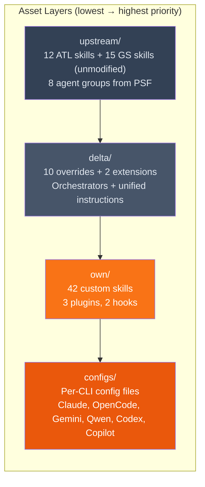

# javi-ai

> AI development layer — skills, orchestrators, and configs for Claude, OpenCode, Gemini, Qwen, Codex, and Copilot

[](https://www.npmjs.com/package/javi-ai)
[](LICENSE)

## Quick Start

```bash
# Standalone
npx javi-ai install --cli claude

# Or via the workstation installer
npx javi-dots
```

## Supported CLIs

| CLI | Config Path | Skills Path |
|-----|-------------|-------------|
| **Claude Code** | `~/.claude/` | `~/.claude/skills/` |
| **OpenCode** | `~/.config/opencode/` | `~/.config/opencode/skill/` |
| **Gemini CLI** | `~/.gemini/` | `~/.gemini/skills/` |
| **Qwen** | `~/.qwen/` | `~/.qwen/skills/` |
| **Codex CLI** | `~/.codex/` | `~/.codex/skills/` |
| **GitHub Copilot** | `~/.copilot/` | `~/.copilot/skills/` |

## What's Included

`javi-ai` ships a layered architecture of AI assets. Each layer has a clear purpose and merge priority:



### Layer Details

| Layer | Contents | Source |
|-------|----------|--------|
| `upstream/` | 12 ATL skills + 15 GS skills (unmodified), 8 agent groups | [agent-teams-lite](https://github.com/Gentleman-Programming/agent-teams-lite), [Gentleman-Skills](https://github.com/Gentleman-Programming/gentleman-skills), PSF |
| `delta/` | 10 overrides + 2 extensions, Claude orchestrators, OpenCode agents + domain agents + commands, unified instructions | Modified upstream (ADR-003) |
| `own/` | 42 custom skills, 3 plugins (merge-checks, mermaid, trim-md), 2 Claude hooks | Original creations |
| `configs/` | CLAUDE.md, opencode.json, QWEN.md, gemini-settings.json, codex-config.toml, copilot-instructions.md | Per-CLI configurations |

## Commands

| Command | Description |
|---------|-------------|
| `install` | Install AI development layer for selected CLIs (default) |
| `doctor` | Show health report of current installation |
| `update` | Re-install configured CLIs with fresh assets |
| `uninstall` | Remove javi-ai managed files |
| `sync` | Compile `.ai-config/` into per-CLI config files |

```bash
npx javi-ai install --cli claude,opencode
npx javi-ai doctor
npx javi-ai update
npx javi-ai uninstall
npx javi-ai sync --target claude --mode merge
```

### Install Flags

| Flag | Type | Default | Description |
|------|------|---------|-------------|
| `--dry-run` | boolean | `false` | Preview changes without writing files |
| `--cli` | string | — | Comma-separated CLIs |
| `--yes` / `-y` | boolean | `false` | Non-interactive mode |

### Sync Flags

| Flag | Type | Default | Description |
|------|------|---------|-------------|
| `--target` | string | `all` | CLI target: `claude`, `opencode`, `gemini`, `codex`, `copilot`, `all` |
| `--mode` | string | `overwrite` | Sync mode: `overwrite` or `merge` |
| `--project-dir` | string | `.` | Project directory to sync |
| `--dry-run` | boolean | `false` | Preview without writing |

## Extension Model

Skills follow a 3-layer model (ADR-003). Upstream files are never modified. Customizations live in `delta/`:

- **`delta/overrides/`** — Modified `SKILL.md` files that replace the upstream version (10 overrides)
- **`delta/extensions/`** — `EXTENSION.md` files appended to upstream at install time (2 extensions)

```
delta/extensions/sdd-explore/
└── EXTENSION.md   ← additions, appended at install time

delta/overrides/sdd-apply/
└── SKILL.md       ← replaces upstream SKILL.md entirely
```

Each extension carries a tracking comment:

```markdown
<!-- STATUS: Not yet submitted to upstream -->
<!-- ACTION: If upstream incorporates X, remove this section -->
```

When upstream adds equivalent functionality, the matching extension block is removed.

## Merge Strategies

`javi-ai` uses different merge strategies depending on file type:

| File Type | Strategy | Behavior |
|-----------|----------|----------|
| `.json` | Deep merge | Objects merged recursively, arrays deduplicated |
| `.md` | Marker merge | Content placed between `<!-- BEGIN JAVI-AI -->` / `<!-- END JAVI-AI -->` markers |
| Other files | Create-if-absent | Only copied if target doesn't exist |

Backups are automatically created in `~/.javi-ai/backups/<timestamp>/` before any merge.

## Project-Level Sync

The `sync` command compiles a project's `.ai-config/` directory into per-CLI config files:

```bash
npx javi-ai sync --project-dir /path/to/project
```

It walks `.ai-config/agents/` and `.ai-config/skills/`, reads frontmatter from each markdown file, and generates merged config files like `CLAUDE.md`, `AGENTS.md`, `GEMINI.md`, etc.

A `.skillignore` file in `.ai-config/` can exclude specific skills globally or per-target:

```
# Exclude from all CLIs
some-skill

# Exclude only from opencode
opencode:another-skill
```

## Requirements

- **Node.js** >= 18

## Ecosystem

| Package | Description |
|---------|-------------|
| [javi-dots](https://github.com/JNZader/javi-dots) | Workstation setup (orchestrates javi-ai) |
| **javi-ai** | AI development layer (this package) |
| [javi-forge](https://github.com/JNZader/javi-forge) | Project scaffolding (calls javi-ai sync) |

## License

[MIT](LICENSE)
