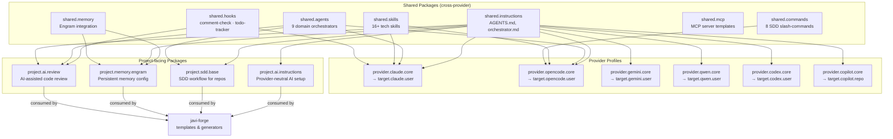
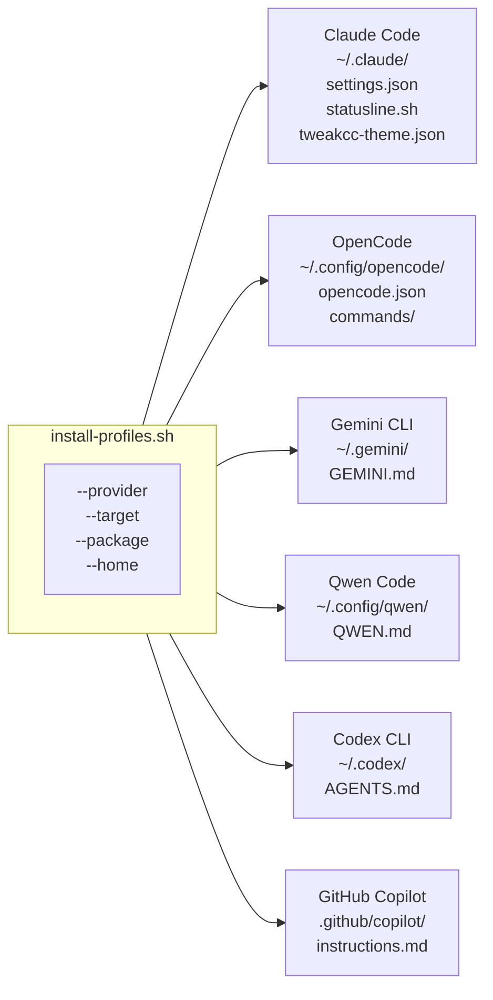

# javi-ai

> **AI coding assistant layer for the Javi ecosystem.** Manages provider profiles, shared packages, and project-facing AI contracts for Claude Code, OpenCode, Gemini, Qwen, Codex, and Copilot.

---

## Architecture



---

## Provider Parity Matrix



---

## Supported AI CLIs

| Provider | Package ID | Install Target | Runtime Config |
|----------|-----------|----------------|----------------|
| **Claude Code** | `provider.claude.core` | `target.claude.user` | `~/.claude/settings.json` |
| **OpenCode** | `provider.opencode.core` | `target.opencode.user` | `~/.config/opencode/opencode.json` |
| **Gemini CLI** | `provider.gemini.core` | `target.gemini.user` | `~/.gemini/GEMINI.md` |
| **Qwen Code** | `provider.qwen.core` | `target.qwen.user` | `~/.config/qwen/QWEN.md` |
| **Codex CLI** | `provider.codex.core` | `target.codex.user` | `~/.codex/AGENTS.md` |
| **GitHub Copilot** | `provider.copilot.core` | `target.copilot.repo` | `.github/copilot/instructions.md` |

---

## Shared Packages

| Package | Contents | Install path (Claude) |
|---------|----------|-----------------------|
| `shared.instructions` | AGENTS.md, orchestrator.md | `~/.claude/CLAUDE.md` |
| `shared.agents` | Domain orchestrators (9) | `~/.claude/agents/` |
| `shared.skills` | SDD skills + tech skills (16+) | `~/.claude/skills/` |
| `shared.hooks` | comment-check.sh, todo-tracker.sh | `~/.claude/hooks/` |
| `shared.commands` | SDD slash-commands (8) | `~/.config/opencode/commands/` |
| `shared.mcp` | MCP server templates (Claude + OpenCode) | `~/.claude/mcp-servers.template.json` |
| `shared.memory` | Engram integration guide | `~/.claude/engram-config.md` |

---

## Project-facing Packages

For generated repositories that want AI capabilities without coupling to a specific provider:

| Package ID | Composes from | Purpose |
|-----------|---------------|---------|
| `project.ai.instructions` | `shared.instructions` | Provider-neutral AI instructions |
| `project.sdd.base` | `shared.instructions` + `shared.agents` | SDD workflow for project repos |
| `project.memory.engram` | `shared.memory` + `shared.instructions` | Engram persistent memory |
| `project.ai.review` | `shared.hooks` + `shared.agents` + `shared.instructions` | AI-assisted code review |

---

## Quick Usage

### Via javi-dots (recommended)

```bash
# Install Claude Code profile
scripts/javi.sh --preset ai-core --ai-choice ai.claude.user --home "$HOME"

# Install full AI setup (shared packages + provider)
scripts/javi.sh --preset ai-full --ai-choice ai.claude.user --home "$HOME"

# Install all 6 providers
scripts/javi.sh --profile ai-heavy --home "$HOME"
```

### Direct install

```bash
# Dry-run: see what would be installed
scripts/install-profiles.sh \
  --provider claude \
  --target target.claude.user \
  --home "$HOME" \
  --dry-run

# Install Claude Code profile
scripts/install-profiles.sh \
  --provider claude \
  --target target.claude.user \
  --home "$HOME"

# Install Claude profile + shared skills and hooks
scripts/install-profiles.sh \
  --provider claude \
  --package shared.skills \
  --package shared.hooks \
  --home "$HOME"

# List all published contract IDs
scripts/install-profiles.sh --list-contracts
```

---

## Published Contracts

All public surfaces are defined in `manifests/`:

| Manifest | Purpose |
|----------|---------|
| `manifests/providers.yaml` | Six published provider IDs |
| `manifests/packages.yaml` | Shared + provider package catalog |
| `manifests/targets.yaml` | Six install target IDs |
| `manifests/project-packages.yaml` | Four project-facing package IDs |

Contract documentation:

- [`docs/providers/PROVIDER-CONTRACT.md`](docs/providers/PROVIDER-CONTRACT.md) — provider and package contract guide
- [`docs/providers/INSTALL-CONTRACT.md`](docs/providers/INSTALL-CONTRACT.md) — install entrypoint surface
- [`docs/providers/SIX-CLI-PARITY-CHECKLIST.md`](docs/providers/SIX-CLI-PARITY-CHECKLIST.md) — parity matrix for all six CLIs
- [`docs/project-packages/PROJECT-PACKAGE-CONTRACT.md`](docs/project-packages/PROJECT-PACKAGE-CONTRACT.md) — project package contract guide

---

## Ecosystem

| Repo | Role |
|------|------|
| [javi-dots](https://github.com/JNZader/javi-dots) | Workstation setup, consumes javi-ai via contracts |
| **javi-ai** | AI provider profiles, shared packages |
| [javi-forge](https://github.com/JNZader/javi-forge) | Project templates, consumes project packages |
| [javi-platform](https://github.com/JNZader/javi-platform) | Governance, ADRs, SDD artifacts |
