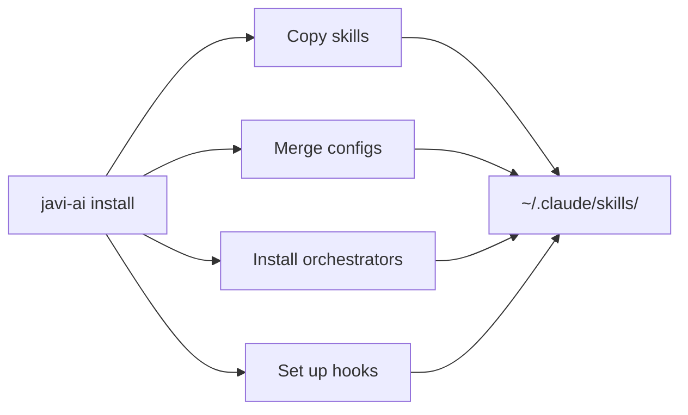

# javi-ai

> AI development layer — skills, orchestrators, and configs for Claude, OpenCode, Gemini, Qwen, Codex, and Copilot

[](https://www.npmjs.com/package/javi-ai)
[](LICENSE)

## Quick Start

```bash
# Install for Claude Code
npx javi-ai install --cli claude

# Install for multiple CLIs
npx javi-ai install --cli claude,opencode,gemini

# Or use the workstation installer for the full experience
npx javi-dots
```

## What Is This?

`javi-ai` is the core engine that installs and manages AI development assets across 6 different coding assistant CLIs. It ships with:

- **37+ skills** from the agent-teams-lite ecosystem
- **8 agent groups** for domain-specific orchestration
- **Per-CLI configurations** that Just Work
- **EXTENSION.md** model for non-destructive upstream customization
- **Project-level sync** for generating per-CLI config from a shared `.ai-config/`



## Supported CLIs

| CLI | Install with |
|-----|-------------|
| **Claude Code** | `--cli claude` |
| **OpenCode** | `--cli opencode` |
| **Gemini CLI** | `--cli gemini` |
| **Qwen** | `--cli qwen` |
| **Codex CLI** | `--cli codex` |
| **GitHub Copilot** | `--cli copilot` |

## Ecosystem

| Package | Role |
|---------|------|
| [javi-dots](https://github.com/JNZader/javi-dots) | Workstation setup (orchestrates javi-ai) |
| **javi-ai** | AI development layer (this package) |
| [javi-forge](https://github.com/JNZader/javi-forge) | Project scaffolding (calls javi-ai sync) |

## License

[MIT](LICENSE)
