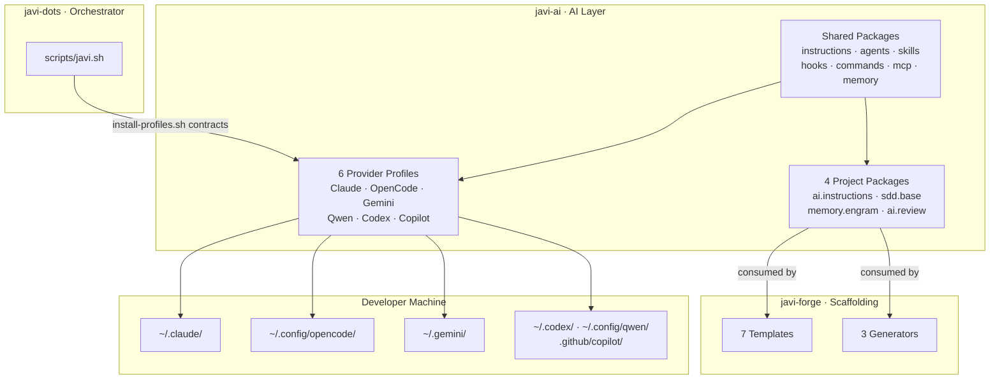
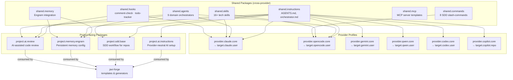

# javi-ai

> **AI coding assistant layer for the Javi ecosystem.** Manages provider profiles, shared packages, and project-facing AI contracts for Claude Code, OpenCode, Gemini, Qwen, Codex, and Copilot.

---

## What is javi-ai?

`javi-ai` is the AI configuration hub of the Javi ecosystem. It defines a **contract-based installation model** — every AI provider, shared package, and project-facing package has a stable published ID that consumers (like `javi-dots` and `javi-forge`) reference without knowing the internal layout.

Key design goals:

- **Provider parity** — all six AI CLIs are treated as first-class citizens
- **Shared-first** — instruction assets, skills, hooks, and commands live in shared packages consumed by all providers
- **Project-safe contracts** — project packages expose only provider-neutral assets to generated repos
- **Symlink delivery** — all user-home assets are installed as symlinks, so `git pull` propagates changes instantly

---

## Ecosystem Role

---

## Architecture

---

## Quick Links

- [Getting Started](/getting-started) — install via javi-dots or directly
- [Providers](/providers) — all 6 providers documented
- [Shared Packages](/shared-packages) — shared cross-provider assets
- [Project Packages](/project-packages) — project-facing AI contracts
- [Install Surface](/install-surface) — `install-profiles.sh` reference
