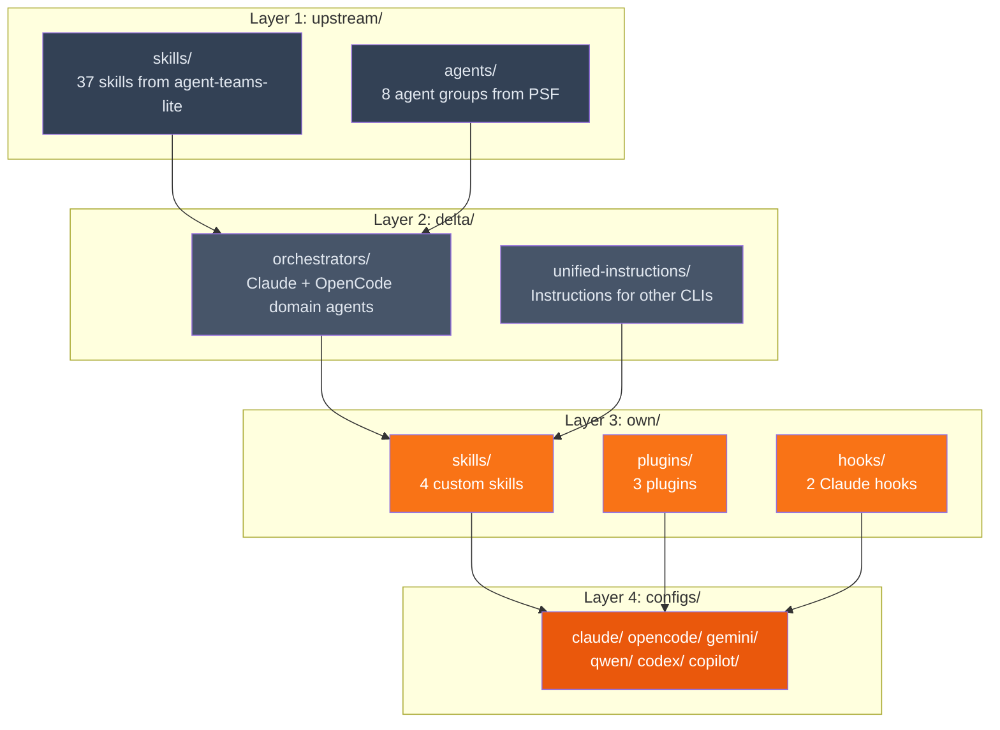
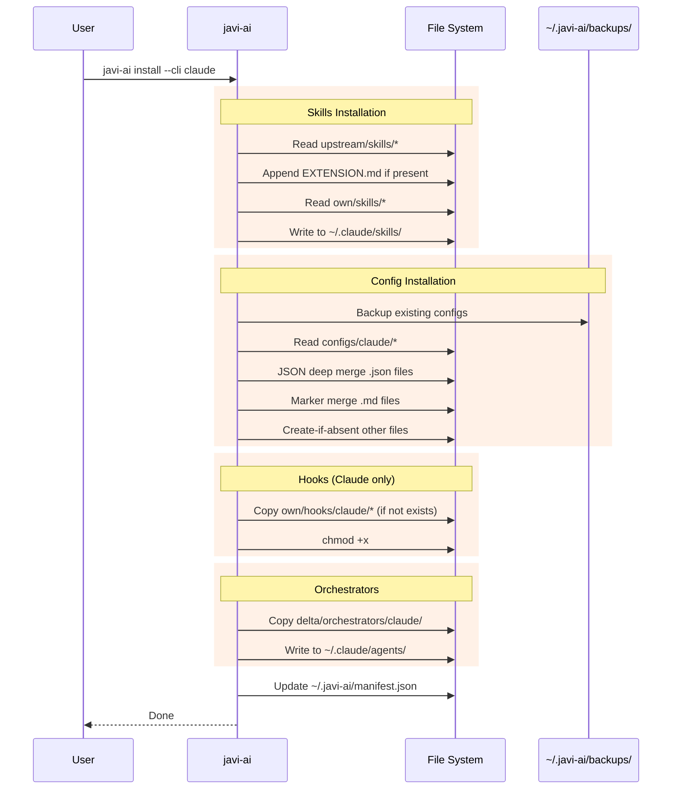
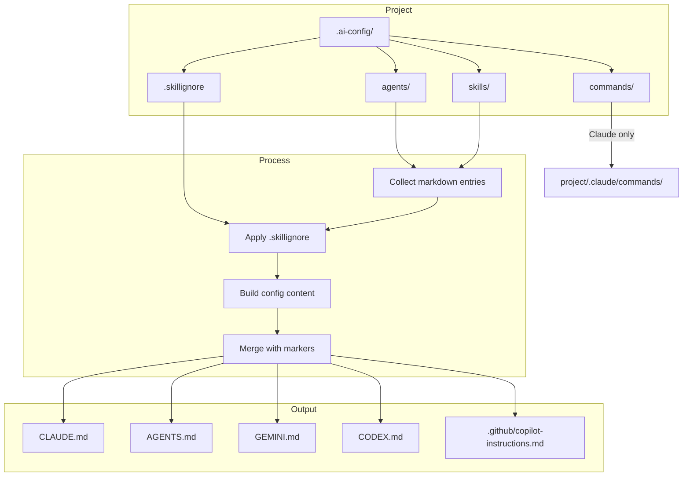

# Architecture

## Layered Asset Model

`javi-ai` organizes AI assets in four layers with clear responsibilities:

## Install Flow

When you run `javi-ai install`, this is the sequence for each selected CLI:

## Sync Flow

The `sync` command compiles project-level `.ai-config/` into per-CLI config files:

## Merge Strategies

| File Type | Strategy | Details |
|-----------|----------|---------|
| `.json` | Deep merge | Nested objects merged recursively; arrays deduplicated by JSON equality |
| `.md` | Marker merge | Content wrapped in `<!-- BEGIN JAVI-AI -->` / `<!-- END JAVI-AI -->` markers |
| Other | Create-if-absent | Copied only if the target file doesn't exist |

## Tech Stack

| Component | Technology |
|-----------|------------|
| CLI framework | [meow](https://github.com/sindresorhus/meow) |
| TUI rendering | [Ink](https://github.com/vadimdemedes/ink) (React for CLI) |
| File operations | [fs-extra](https://github.com/jprichardson/node-fs-extra) |
| Language | TypeScript (strict) |
| Runtime | Node.js 18+ |
| Testing | Vitest + Stryker mutation testing |
