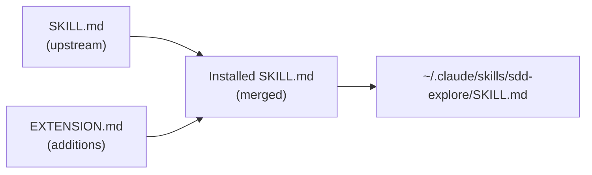
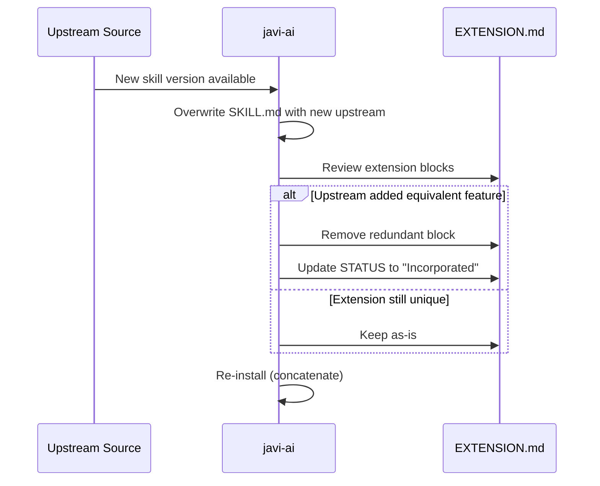

# Extension Model

The Extension Model is how `javi-ai` customizes upstream skills without modifying the original source files.

## How It Works

Some skill folders under `upstream/skills/` contain an `EXTENSION.md` alongside the canonical `SKILL.md`:

```
upstream/skills/sdd-explore/
├── SKILL.md       ← exact copy from upstream (never edit)
└── EXTENSION.md   ← additions, appended at install time
```

During installation, `javi-ai` concatenates both files:



For skills **without** an `EXTENSION.md`, the `SKILL.md` is copied directly.

## Extension Format

Each extension block carries a tracking comment for upstream sync:

```markdown
<!-- STATUS: Not yet submitted to agent-teams-lite upstream -->
<!-- ACTION: If Gentleman incorporates X in upstream, remove this section -->
<!-- PR: pending -->
```

### Status Values

| Status | Meaning |
|--------|---------|
| `Not yet submitted` | Extension exists only in javi-ai |
| `PR submitted` | Upstream PR is open |
| `Incorporated in upstream vX.Y` | Upstream added the feature — extension block can be removed |

## Upstream Sync Workflow

When [agent-teams-lite](https://github.com/Gentleman-Programming/agent-teams-lite) releases updates:



### Step by step

1. **Compare** `upstream/skills/<skill>/SKILL.md` against the upstream source
2. **Overwrite** `SKILL.md` with the new upstream content (verbatim)
3. **Review** `EXTENSION.md` — check if any block is now redundant
4. **Remove** redundant blocks and update the STATUS comment
5. **Re-install** to rebuild the concatenated skill

## Why Not Edit SKILL.md Directly?

Keeping upstream files unmodified means:

- **Clean diffs** — you can always compare against upstream
- **Safe updates** — overwriting SKILL.md with a new version never loses your customizations
- **Clear provenance** — anyone can see what's upstream vs. custom
