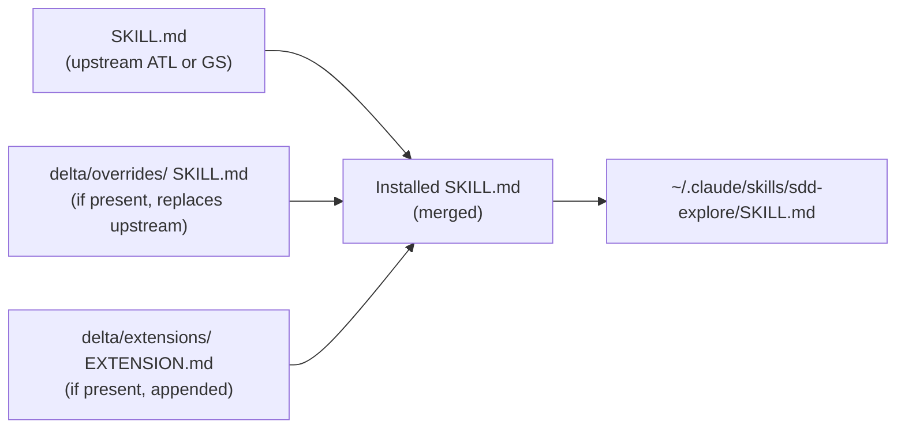
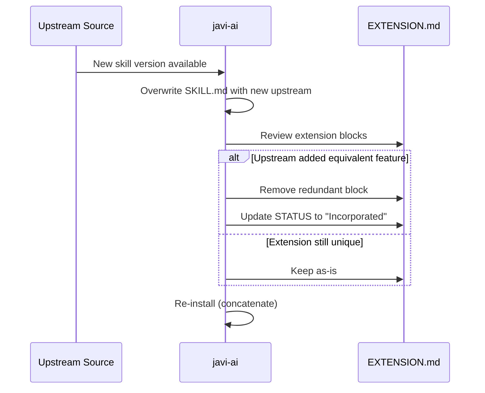

# Extension Model

The Extension Model is how `javi-ai` customizes upstream skills without modifying the original source files.

## How It Works

Since ADR-003, skills are organized in a 3-layer model. The extension model now uses two mechanisms under `delta/`:

- **`delta/overrides/`** — Contains modified `SKILL.md` files that replace the upstream version entirely (10 overrides for ATL skills).
- **`delta/extensions/`** — Contains `EXTENSION.md` files that are appended to the upstream `SKILL.md` at install time (2 extensions: sdd-apply, sdd-explore).

```
delta/extensions/sdd-explore/
└── EXTENSION.md   ← additions, appended at install time

delta/overrides/sdd-apply/
└── SKILL.md       ← replaces upstream SKILL.md entirely
```

During installation, `javi-ai` resolves the final SKILL.md per skill using layer priority:



Priority: ATL < GS < delta/overrides < own. For skills without an override or extension, the upstream `SKILL.md` is copied directly.

## Extension Format

Each extension block carries a tracking comment for upstream sync:

```markdown
<!-- STATUS: Not yet submitted to agent-teams-lite upstream -->
<!-- ACTION: If Gentleman incorporates X in upstream, remove this section -->
<!-- PR: pending -->
```

### Status Values

| Status | Meaning |
|--------|---------|
| `Not yet submitted` | Extension exists only in javi-ai |
| `PR submitted` | Upstream PR is open |
| `Incorporated in upstream vX.Y` | Upstream added the feature — extension block can be removed |

## Upstream Sync Workflow

When [agent-teams-lite](https://github.com/Gentleman-Programming/agent-teams-lite) releases updates:



### Step by step

1. **Compare** `upstream/agent-teams-lite/skills/<skill>/SKILL.md` (or `upstream/gentleman-skills/curated/`) against the upstream source
2. **Overwrite** the upstream `SKILL.md` with the new content (verbatim)
3. **Review** `delta/overrides/` and `delta/extensions/` — check if any override or extension block is now redundant
4. **Remove** redundant blocks and update the STATUS comment
5. **Re-install** to rebuild the merged skill

## Why Not Edit SKILL.md Directly?

Keeping upstream files unmodified means:

- **Clean diffs** — you can always compare against upstream
- **Safe updates** — overwriting SKILL.md with a new version never loses your customizations
- **Clear provenance** — anyone can see what's upstream vs. custom
