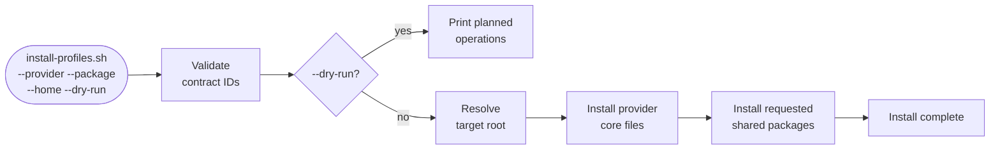

# Getting Started

## Prerequisites

- A POSIX-compatible shell (bash, zsh, fish)
- `git`
- For javi-dots integration: the platform repos cloned as siblings

```
platform/
├── javi-dots/       ← orchestrator (recommended)
├── javi-ai/         ← this repo
└── javi-forge/      ← required for project packages
```

---

## Install via javi-dots (recommended)

`javi-dots` is the standard way to consume `javi-ai`. It calls `install-profiles.sh` via its contract surface, so you never need to invoke javi-ai scripts directly.

<!-- tabs:start -->

#### **Preset — ai-core**

Install a single provider (Claude by default):

```bash
cd javi-dots
scripts/javi.sh --preset ai-core --ai-choice ai.claude.user --home "$HOME"
```

#### **Preset — ai-full**

Install a provider plus all shared packages (skills, hooks, commands, mcp, memory):

```bash
cd javi-dots
scripts/javi.sh --preset ai-full --ai-choice ai.claude.user --home "$HOME"
```

#### **Profile — ai-heavy**

Install all 6 providers with full shared packages:

```bash
cd javi-dots
scripts/javi.sh --profile ai-heavy --home "$HOME"
```

<!-- tabs:end -->

---

## Install directly

For more control, call `install-profiles.sh` from the `javi-ai` repo:

### Step 1 — Clone javi-ai

```bash
git clone https://github.com/JNZader/javi-ai.git
cd javi-ai
```

### Step 2 — Dry-run first

Always preview before applying. The dry-run prints every planned symlink/copy without touching your filesystem:

```bash
scripts/install-profiles.sh \
  --provider claude \
  --target target.claude.user \
  --home "$HOME" \
  --dry-run
```

### Step 3 — Install a provider

```bash
# Claude Code
scripts/install-profiles.sh \
  --provider claude \
  --target target.claude.user \
  --home "$HOME"

# OpenCode
scripts/install-profiles.sh \
  --provider opencode \
  --target target.opencode.user \
  --home "$HOME"

# Gemini CLI
scripts/install-profiles.sh \
  --provider gemini \
  --target target.gemini.user \
  --home "$HOME"
```

### Step 4 — Add shared packages (optional)

```bash
# Claude + skills and hooks
scripts/install-profiles.sh \
  --provider claude \
  --package shared.skills \
  --package shared.hooks \
  --home "$HOME"

# Claude + everything
scripts/install-profiles.sh \
  --provider claude \
  --package shared.agents \
  --package shared.skills \
  --package shared.hooks \
  --package shared.commands \
  --package shared.mcp \
  --package shared.memory \
  --home "$HOME"
```

---

## List all published contracts

```bash
scripts/install-profiles.sh --list-contracts
```

Output:

```yaml
contract_version: 0.1.0
providers:
  - claude
  - opencode
  - gemini
  - qwen
  - codex
  - copilot
packages:
  - shared.instructions
  - shared.agents
  - shared.skills
  - shared.hooks
  - shared.commands
  - shared.mcp
  - shared.memory
  - provider.claude.core
  - provider.opencode.core
  - provider.gemini.core
  - provider.qwen.core
  - provider.codex.core
  - provider.copilot.core
targets:
  - target.claude.user
  - target.opencode.user
  - target.gemini.user
  - target.qwen.user
  - target.codex.user
  - target.copilot.repo
```

---

## Installation flow



---

## Updating

Because all user-home assets are symlinks back to the repo, a `git pull` is all you need:

```bash
cd javi-ai
git pull
# Symlinks already point to the new content — no re-run needed
```

If new files were added to a package, re-run the install to link them:

```bash
scripts/install-profiles.sh \
  --provider claude \
  --package shared.skills \
  --home "$HOME"
```

---

## Next steps

- [Providers](/providers) — understand each provider and its install target
- [Shared Packages](/shared-packages) — explore the cross-provider package catalog
- [Install Surface](/install-surface) — full flag reference for `install-profiles.sh`
