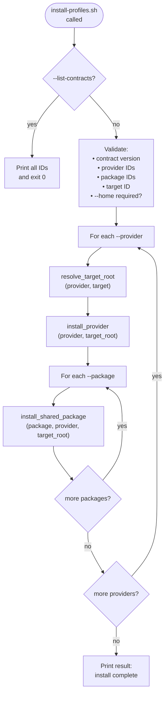

# Install Surface

`scripts/install-profiles.sh` is the public entrypoint for javi-ai. It validates contract IDs, resolves target roots, and installs provider files plus shared packages via symlinks or copies.

---

## Synopsis

```bash
scripts/install-profiles.sh [OPTIONS]
```

---

## Flags

| Flag | Argument | Repeatable | Description |
|------|----------|-----------|-------------|
| `--provider` | ID | yes | Published provider ID to install |
| `--package` | ID | yes | Published shared/project package ID to install |
| `--target` | ID | no | Explicit install target ID (auto-derived from provider if omitted) |
| `--home` | DIR | no | Target home directory (required for all user-profile targets) |
| `--destination` | DIR | no | Output directory for repo-scoped targets (`target.copilot.repo`) |
| `--preset` | ID | yes | Reserved preset identifier (for future javi-dots integration) |
| `--contract-version` | VER | no | Contract version to pin (default: `0.1.0`) |
| `--dry-run` | — | no | Print planned file operations without executing |
| `--list-contracts` | — | no | Print all published provider, package, and target IDs |
| `-h, --help` | — | no | Show usage message |

---

## Target auto-derivation

If `--target` is omitted, the install target is derived from the provider:

| Provider | Auto-derived target |
|----------|-------------------|
| `claude` | `target.claude.user` |
| `opencode` | `target.opencode.user` |
| `gemini` | `target.gemini.user` |
| `qwen` | `target.qwen.user` |
| `codex` | `target.codex.user` |
| `copilot` | `target.copilot.repo` |

---

## Target root resolution

| Target | Root path |
|--------|-----------|
| `target.claude.user` | `<home>/.claude/` |
| `target.opencode.user` | `<home>/.config/opencode/` |
| `target.gemini.user` | `<home>/.gemini/` |
| `target.qwen.user` | `<home>/.config/qwen/` |
| `target.codex.user` | `<home>/.codex/` |
| `target.copilot.repo` | `<destination>/.github/` |

---

## File delivery modes

| Mode | When used | Behavior on existing file |
|------|-----------|--------------------------|
| `link_asset` | Provider runtime files, agent dirs, skill dirs | Skip if target exists and is a different non-symlink file |
| `copy_asset` | `shared.instructions` (provider-specific filenames) | Skip if target file already exists |
| `link_dir_contents` | `shared.agents`, `shared.skills` | Links each subdirectory individually |

---

## Execution flow



---

## Dry-run examples

### Preview Claude Code install

```bash
scripts/install-profiles.sh \
  --provider claude \
  --target target.claude.user \
  --home "$HOME" \
  --dry-run
```

Expected output (excerpt):

```
entrypoint: javi-ai/scripts/install-profiles.sh
mode: install
contract_version: 0.1.0
dry_run: true
providers:
  - claude
packages:
  - none-requested
target: target.claude.user
home: /home/yourname

--- provider: claude target: target.claude.user root: /home/yourname/.claude
dry-run: ln -sfn /path/to/javi-ai/packages/providers/claude/runtime/settings.json /home/yourname/.claude/settings.json
dry-run: ln -sfn /path/to/javi-ai/packages/providers/claude/overrides/statusline.sh /home/yourname/.claude/statusline.sh
dry-run: ln -sfn /path/to/javi-ai/packages/providers/claude/overrides/tweakcc-theme.json /home/yourname/.claude/tweakcc-theme.json

result: dry-run plan complete
```

### Preview all providers + all shared packages

```bash
scripts/install-profiles.sh \
  --provider claude \
  --provider opencode \
  --provider gemini \
  --provider qwen \
  --provider codex \
  --provider copilot \
  --package shared.instructions \
  --package shared.agents \
  --package shared.skills \
  --package shared.hooks \
  --package shared.commands \
  --package shared.mcp \
  --package shared.memory \
  --home "$HOME" \
  --dry-run
```

### List all contracts

```bash
scripts/install-profiles.sh --list-contracts
```

---

## Error cases

| Condition | Error message |
|-----------|---------------|
| No `--provider` given | `error: at least one --provider is required` |
| Unknown provider ID | `error: unsupported provider ID: <id>` |
| Unknown package ID | `error: unsupported package ID: <id>` |
| Unknown target ID | `error: unsupported target ID: <id>` |
| `--home` missing for user target | `error: --home is required for user-profile targets` |
| Contract version mismatch | `error: unsupported contract version: <ver>` |

---

## Idempotency

The installer is designed to be run repeatedly:

- **Existing symlinks** with the same target: printed as `ok: <path>` and left unchanged
- **Existing non-symlink files**: printed as `skip (file exists): <path>` and left unchanged
- **Missing source files**: printed as `skip (missing source): <path>` and skipped

This means re-running after a `git pull` is safe and will only create new links.
