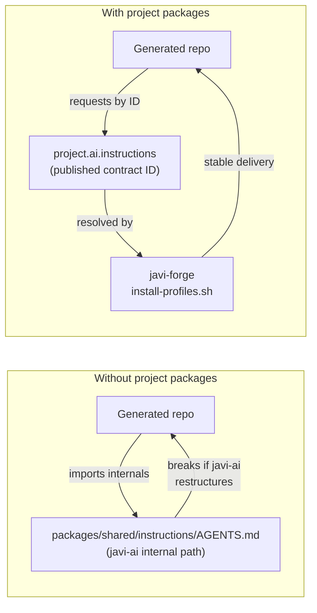
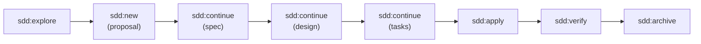
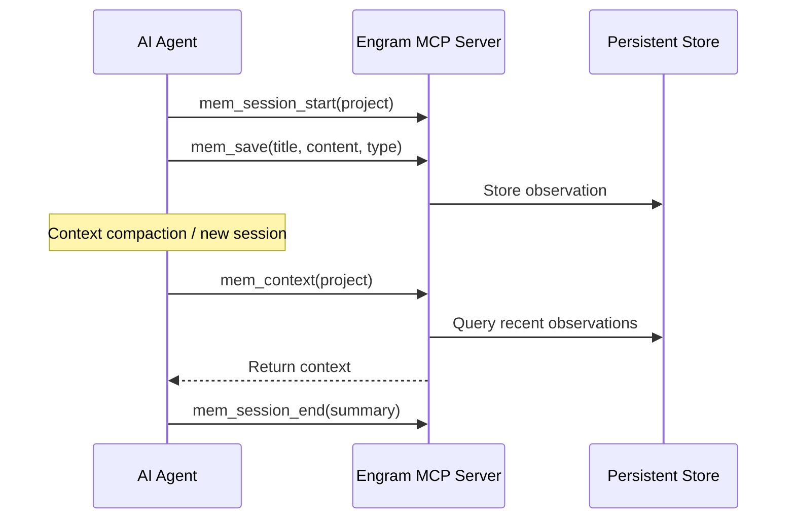
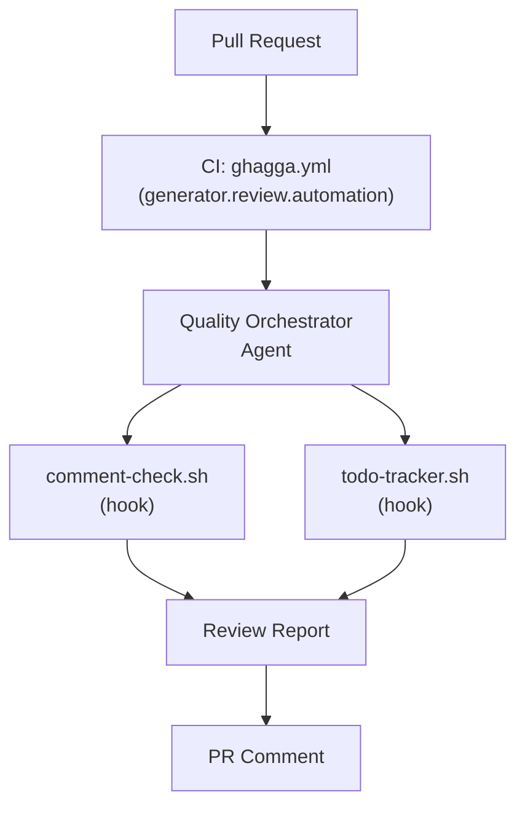
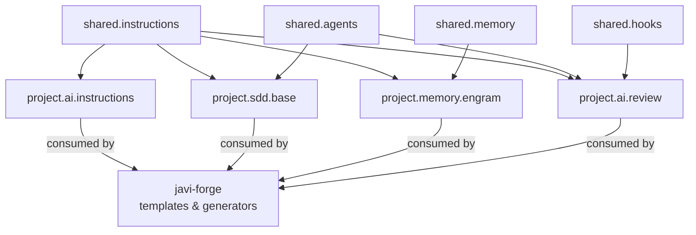

# Project Packages

Project packages are **provider-neutral AI contracts** designed for generated repositories. Where provider packages install to a developer's machine, project packages install into project repos — giving any project AI capabilities without coupling it to a specific provider.

All four project packages are defined in `manifests/project-packages.yaml` and consumed primarily by `javi-forge`.

---

## Why project packages?



---

## Package catalog

| Package ID | Composed from | Purpose |
|-----------|---------------|---------|
| `project.ai.instructions` | `shared.instructions` | Provider-neutral AI instructions |
| `project.sdd.base` | `shared.instructions` + `shared.agents` | SDD workflow for project repos |
| `project.memory.engram` | `shared.memory` + `shared.instructions` | Engram persistent memory |
| `project.ai.review` | `shared.hooks` + `shared.agents` + `shared.instructions` | AI-assisted code review |

---

## project.ai.instructions

**ID:** `project.ai.instructions` · **Version:** `0.1.0` · **Status:** published

The minimum AI setup for any generated project. Delivers the canonical instruction baseline without any provider-specific configuration.

### Composes from

```
shared.instructions
```

### Exported capabilities

- Reusable AI instructions for repository-level guidance
- Provider-neutral policy and prompt baseline

### What gets installed in a project

```
<project-root>/
└── CLAUDE.md            # (or equivalent instruction file)
```

### Allowed consumers

- `javi-forge` (templates and generators)
- Generated repositories

### Example request via forge-init.sh

```bash
scripts/forge-init.sh \
  --template template.api.go \
  --project-name my-api \
  --ai-package project.ai.instructions \
  --destination ~/projects
```

---

## project.sdd.base

**ID:** `project.sdd.base` · **Version:** `0.1.0` · **Status:** published

The full Spec-Driven Development (SDD) setup for project repos. Adds orchestrator agents and planning agents on top of the instruction baseline.

### Composes from

```
shared.instructions
shared.agents
```

### Exported capabilities

- Reusable SDD workflow guidance
- Orchestrator and planning agents (domain orchestrators)
- `/sdd:*` command integration guidance

### What gets installed in a project

```
<project-root>/
├── CLAUDE.md             # AI instructions
├── .agents/              # SDD orchestrators
│   └── workflow-orchestrator/
│   └── error-detective/
│   └── ...
└── openspec/             # SDD artifact directory (created by /sdd:init)
```

### SDD workflow



---

## project.memory.engram

**ID:** `project.memory.engram` · **Version:** `0.1.0` · **Status:** published

Engram persistent memory integration for projects that want cross-session AI memory. Installs the setup guide and MCP server configuration template.

### Composes from

```
shared.memory
shared.instructions
```

### Exported capabilities

- Engram MCP server integration guide
- Provider-neutral memory setup instructions
- Session summary protocol for context preservation

### What gets installed in a project

```
<project-root>/
├── CLAUDE.md             # AI instructions (with Engram protocol)
└── .ai/
    └── engram-config.md  # MCP server setup guide
```

### Memory protocol



---

## project.ai.review

**ID:** `project.ai.review` · **Version:** `0.1.0` · **Status:** published

AI-assisted code review assets for projects. Combines hook scripts (comment-check, todo-tracker) with the quality orchestrator agent.

### Composes from

```
shared.hooks
shared.agents
shared.instructions
```

### Exported capabilities

- `comment-check.sh` — enforces comment quality on file edits
- `todo-tracker.sh` — tracks TODO/FIXME items
- Quality orchestrator agent for systematic review

### What gets installed in a project

```
<project-root>/
├── CLAUDE.md
├── .agents/
│   └── quality-orchestrator/
└── .hooks/
    ├── comment-check.sh
    └── todo-tracker.sh
```

### Review flow



---

## Composition diagram



---

## Consumer rules

Per the project-package contract (`manifests/project-packages.yaml`):

1. **Consume published IDs only** — request `project.ai.instructions`, never `shared.instructions` directly
2. **No provider exposure** — project packages must not expose provider-specific assets
3. **Reserved IDs** — remain unavailable until promoted to concrete records
