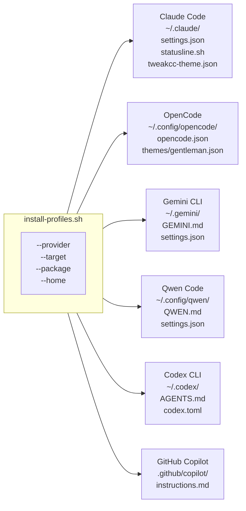
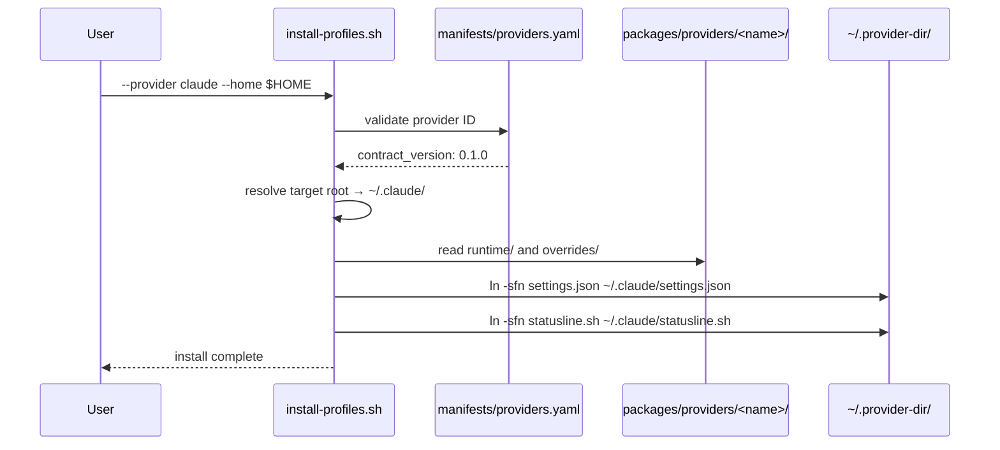

# Providers

`javi-ai` supports six AI coding CLIs as first-class providers. Each provider has:

- A **package ID** (`provider.<name>.core`) defined in `manifests/providers.yaml`
- An **install target** (`target.<name>.user` or `target.<name>.repo`)
- A **target root** — the directory where assets are linked
- A minimum set of required packages installed with the core profile

---

## Provider overview



---

## Parity matrix

| Provider | Package ID | Install Target | Target Root |
|----------|-----------|----------------|-------------|
| **Claude Code** | `provider.claude.core` | `target.claude.user` | `~/.claude/` |
| **OpenCode** | `provider.opencode.core` | `target.opencode.user` | `~/.config/opencode/` |
| **Gemini CLI** | `provider.gemini.core` | `target.gemini.user` | `~/.gemini/` |
| **Qwen Code** | `provider.qwen.core` | `target.qwen.user` | `~/.config/qwen/` |
| **Codex CLI** | `provider.codex.core` | `target.codex.user` | `~/.codex/` |
| **GitHub Copilot** | `provider.copilot.core` | `target.copilot.repo` | `.github/copilot/` |

---

## Claude Code

**Family:** Anthropic · **Target:** `target.claude.user` · **Root:** `~/.claude/`

Claude Code is the primary first-class provider with the richest feature set. It receives `shared.agents`, `shared.skills`, and `shared.hooks` at install time.

### Installed files

| Source | Destination |
|--------|-------------|
| `packages/providers/claude/runtime/settings.json` | `~/.claude/settings.json` |
| `packages/providers/claude/overrides/statusline.sh` | `~/.claude/statusline.sh` |
| `packages/providers/claude/overrides/tweakcc-theme.json` | `~/.claude/tweakcc-theme.json` |

### Install example

```bash
# Core profile only
scripts/install-profiles.sh \
  --provider claude \
  --target target.claude.user \
  --home "$HOME"

# Core + skills + hooks + memory
scripts/install-profiles.sh \
  --provider claude \
  --package shared.skills \
  --package shared.hooks \
  --package shared.memory \
  --home "$HOME"
```

### shared.instructions delivery (Claude)

```
shared/instructions/AGENTS.md  →  ~/.claude/CLAUDE.md
```

---

## OpenCode

**Family:** OpenCode · **Target:** `target.opencode.user` · **Root:** `~/.config/opencode/`

OpenCode receives the `shared.commands` package — 8 SDD slash-commands — which are placed in `~/.config/opencode/commands/`.

### Installed files

| Source | Destination |
|--------|-------------|
| `packages/providers/opencode/runtime/opencode.json` | `~/.config/opencode/opencode.json` |
| `packages/providers/opencode/overrides/gentleman-theme.json` | `~/.config/opencode/themes/gentleman.json` |

### Install example

```bash
scripts/install-profiles.sh \
  --provider opencode \
  --target target.opencode.user \
  --package shared.commands \
  --home "$HOME"
```

### shared.instructions delivery (OpenCode)

```
shared/instructions/AGENTS.md  →  ~/.config/opencode/AGENTS.md
```

---

## Gemini CLI

**Family:** Google · **Target:** `target.gemini.user` · **Root:** `~/.gemini/`

Gemini CLI uses a Markdown-based instruction file (`GEMINI.md`) alongside a `settings.json`.

### Installed files

| Source | Destination |
|--------|-------------|
| `packages/providers/gemini/runtime/GEMINI.md` | `~/.gemini/GEMINI.md` |
| `packages/providers/gemini/runtime/settings.json` | `~/.gemini/settings.json` |

### Install example

```bash
scripts/install-profiles.sh \
  --provider gemini \
  --target target.gemini.user \
  --home "$HOME"
```

---

## Qwen Code

**Family:** Alibaba Cloud (Qwen) · **Target:** `target.qwen.user` · **Root:** `~/.config/qwen/`

Qwen Code follows a similar pattern to Gemini with a `QWEN.md` instruction file.

### Installed files

| Source | Destination |
|--------|-------------|
| `packages/providers/qwen/runtime/QWEN.md` | `~/.config/qwen/QWEN.md` |
| `packages/providers/qwen/runtime/settings.json` | `~/.config/qwen/settings.json` |

### Install example

```bash
scripts/install-profiles.sh \
  --provider qwen \
  --target target.qwen.user \
  --home "$HOME"
```

---

## Codex CLI

**Family:** OpenAI · **Target:** `target.codex.user` · **Root:** `~/.codex/`

Codex CLI uses `AGENTS.md` (same filename as the shared instruction source) and a TOML runtime config.

### Installed files

| Source | Destination |
|--------|-------------|
| `packages/providers/codex/runtime/AGENTS.md` | `~/.codex/AGENTS.md` |
| `packages/providers/codex/runtime/codex.toml` | `~/.codex/codex.toml` |

### Install example

```bash
scripts/install-profiles.sh \
  --provider codex \
  --target target.codex.user \
  --home "$HOME"
```

---

## GitHub Copilot

**Family:** GitHub · **Target:** `target.copilot.repo` · **Root:** `.github/copilot/` (repo-scoped)

Copilot is the only **repo-scoped** provider — its assets are installed into the current project directory rather than user home. Use `--destination` to specify the target repo path.

### Installed files

| Source | Destination |
|--------|-------------|
| `packages/providers/copilot/runtime/copilot-instructions.md` | `.github/copilot/instructions.md` |

### Install example

```bash
# Install into a project repo
scripts/install-profiles.sh \
  --provider copilot \
  --target target.copilot.repo \
  --destination ~/projects/my-repo

# Install into current directory
scripts/install-profiles.sh \
  --provider copilot \
  --target target.copilot.repo
```

---

## Provider flow



---

## Adding optional packages to any provider

Any provider can receive any combination of shared packages:

```bash
# All six providers with all shared packages
for provider in claude opencode gemini qwen codex copilot; do
  scripts/install-profiles.sh \
    --provider "$provider" \
    --package shared.instructions \
    --package shared.agents \
    --package shared.skills \
    --package shared.hooks \
    --package shared.commands \
    --package shared.mcp \
    --package shared.memory \
    --home "$HOME"
done
```

> **Note:** Some shared packages have provider-specific install paths. If no path is defined for a given provider, the script prints a `note:` and skips gracefully.
