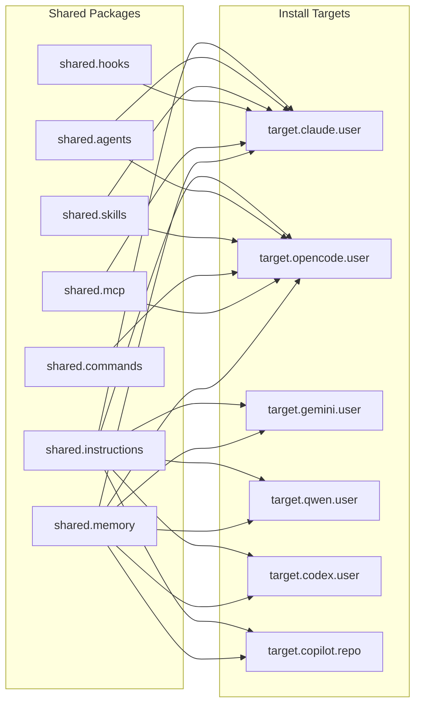
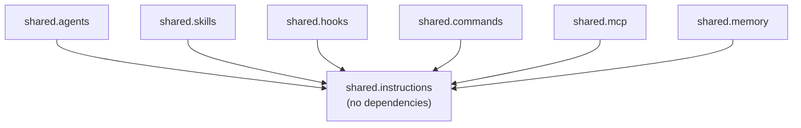

# Shared Packages

Shared packages are **cross-provider assets** — a single canonical source that gets installed to each provider's target directory with the appropriate filename mapping. All shared packages depend on `shared.instructions` and are installed on top of any provider profile.

---

## Package catalog



---

## shared.instructions

**ID:** `shared.instructions` · **Version:** `0.1.0` · **Dependencies:** none

The canonical AI instruction file. This is the most important shared package — it gives every provider the same baseline agent behavior, orchestration model, and workflow guidance.

### Source

```
packages/shared/instructions/AGENTS.md
```

### Install paths by provider

| Provider | Destination |
|----------|-------------|
| claude | `~/.claude/CLAUDE.md` |
| opencode | `~/.config/opencode/AGENTS.md` |
| gemini | `~/.gemini/GEMINI.md` |
| qwen | `~/.config/qwen/QWEN.md` |
| codex | `~/.codex/AGENTS.md` |
| copilot | `.github/copilot/instructions.md` |

> **Note:** `shared.instructions` is always installed as a **copy** (not a symlink), so each provider gets an independent file that can be customized without affecting others.

### Install

```bash
scripts/install-profiles.sh \
  --provider claude \
  --package shared.instructions \
  --home "$HOME"
```

---

## shared.agents

**ID:** `shared.agents` · **Version:** `0.1.0` · **Dependencies:** `shared.instructions`

Nine domain orchestrator agents for task routing, debugging, migration, automation, and freelance workflows. These are subdirectory-mounted agents that Claude Code and OpenCode can invoke.

### Source

```
packages/shared/agents/orchestrators/
├── workflow-orchestrator/
├── error-detective/
├── code-migrator/
├── ...
```

### Install paths by provider

| Provider | Destination |
|----------|-------------|
| claude | `~/.claude/agents/orchestrators/<agent>/` |
| opencode | `~/.config/opencode/agents/<agent>/` |
| others | _(not yet defined — skipped gracefully)_ |

### Install

```bash
scripts/install-profiles.sh \
  --provider claude \
  --package shared.agents \
  --home "$HOME"
```

---

## shared.skills

**ID:** `shared.skills` · **Version:** `0.1.0` · **Dependencies:** `shared.instructions`

16+ reusable AI skills — technology-specific patterns and workflows loaded on demand by the agent. Includes skills for Next.js, React, Go, Java, Python, Docker, Kubernetes, and more.

### Source

```
packages/shared/skills/
├── nextjs-15/
├── react-19/
├── go-backend/
├── ...
```

### Install paths by provider

| Provider | Destination |
|----------|-------------|
| claude | `~/.claude/skills/<skill>/` |
| opencode | `~/.config/opencode/skill/<skill>/` |
| others | _(not yet defined)_ |

### Install

```bash
scripts/install-profiles.sh \
  --provider claude \
  --package shared.skills \
  --home "$HOME"
```

---

## shared.hooks

**ID:** `shared.hooks` · **Version:** `0.1.0` · **Dependencies:** `shared.instructions`

Automation hook scripts that run on Claude Code events:

| Hook | Trigger | Purpose |
|------|---------|---------|
| `comment-check.sh` | PostToolUse | Enforces comment quality standards |
| `todo-tracker.sh` | PostToolUse | Tracks TODO/FIXME items across edits |

### Source

```
packages/shared/hooks/scripts/
├── comment-check.sh
└── todo-tracker.sh
```

### Install paths by provider

| Provider | Destination |
|----------|-------------|
| claude | `~/.claude/hooks/<script>` |
| others | _(not yet defined)_ |

### Install

```bash
scripts/install-profiles.sh \
  --provider claude \
  --package shared.hooks \
  --home "$HOME"
```

---

## shared.commands

**ID:** `shared.commands` · **Version:** `0.1.0` · **Dependencies:** `shared.instructions`

Eight SDD (Spec-Driven Development) slash-commands for OpenCode's command palette:

| Command | Purpose |
|---------|---------|
| `/sdd:init` | Bootstrap `openspec/` in current project |
| `/sdd:explore` | Think through an idea (no files written) |
| `/sdd:new` | Start a new change proposal |
| `/sdd:continue` | Create next artifact in the SDD chain |
| `/sdd:ff` | Fast-forward all planning phases |
| `/sdd:apply` | Implement tasks following specs |
| `/sdd:verify` | Validate implementation against specs |
| `/sdd:archive` | Sync specs and archive completed change |

### Source

```
packages/shared/commands/
├── sdd-init/
├── sdd-new/
├── ...
```

### Install paths by provider

| Provider | Destination |
|----------|-------------|
| opencode | `~/.config/opencode/commands/<command>/` |
| others | _(not yet defined)_ |

### Install

```bash
scripts/install-profiles.sh \
  --provider opencode \
  --package shared.commands \
  --home "$HOME"
```

---

## shared.mcp

**ID:** `shared.mcp` · **Version:** `0.1.0` · **Dependencies:** `shared.instructions`

MCP (Model Context Protocol) server templates. These are **template** files, not live configs — copy and customize them to add MCP servers to your provider setup.

### Source

```
packages/shared/mcp/
├── mcp-servers.template.json     # Claude Code format
└── opencode-mcp.template.json    # OpenCode format
```

### Install paths by provider

| Provider | Destination |
|----------|-------------|
| claude | `~/.claude/mcp-servers.template.json` |
| opencode | `~/.config/opencode/mcp.template.json` |
| others | _(not yet defined)_ |

### Usage after install

```bash
# Claude Code: copy the template and customize
cp ~/.claude/mcp-servers.template.json ~/.claude/mcp-servers.json
# Edit ~/.claude/mcp-servers.json to add your MCP server entries
```

### Install

```bash
scripts/install-profiles.sh \
  --provider claude \
  --package shared.mcp \
  --home "$HOME"
```

---

## shared.memory

**ID:** `shared.memory` · **Version:** `0.1.0` · **Dependencies:** `shared.instructions`

Engram persistent memory integration guide. Provides setup instructions for cross-session AI memory using the Engram MCP server.

### Source

```
packages/shared/memory/
└── engram-config.md
```

### Install paths by provider

All providers receive the same file at `<target-root>/engram-config.md`:

| Provider | Destination |
|----------|-------------|
| claude | `~/.claude/engram-config.md` |
| opencode | `~/.config/opencode/engram-config.md` |
| gemini | `~/.gemini/engram-config.md` |
| qwen | `~/.config/qwen/engram-config.md` |
| codex | `~/.codex/engram-config.md` |

### Install

```bash
scripts/install-profiles.sh \
  --provider claude \
  --package shared.memory \
  --home "$HOME"
```

---

## Dependency graph



All shared packages depend on `shared.instructions`. Installing any package will automatically trigger installation of `shared.instructions` first.
