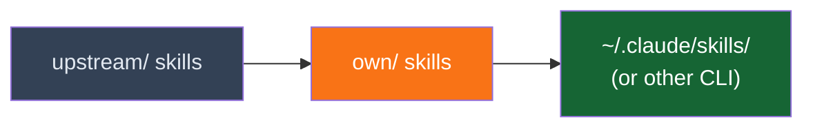

# Skills

`javi-ai` ships with a rich library of skills organized in two sources: **upstream** (community-maintained) and **own** (custom creations).

## Upstream Skills

37 skills sourced from [agent-teams-lite](https://github.com/Gentleman-Programming/agent-teams-lite) and shared conventions. These cover a wide range of development domains:

### Skill Categories

| Domain | Skills |
|--------|--------|
| **Backend** | go-backend, chi-router, pgx-postgres, fastapi, django-drf, spring-boot-3/4, graphql, gRPC, websockets, error-handling, jwt-auth, BFF, search, notifications |
| **Frontend** | frontend-web, frontend-design, astro-ssr, mantine-ui, tanstack-query, zustand-state, zod-validation |
| **Infrastructure** | docker-containers, kubernetes, traefik-proxy, woodpecker-ci, chaos-engineering, opentelemetry |
| **Database** | redis-cache, sqlite-embedded, timescaledb, graph-databases, pgx-postgres |
| **Data / AI** | langchain, vector-db, scikit-learn, pytorch, mlflow, onnx-inference, duckdb-analytics, powerbi |
| **Mobile** | ionic-capacitor, react-native |
| **Systems / IoT** | rust-systems, tokio-async, modbus-protocol, mqtt-rumqttc |
| **Workflow** | git-workflow, wave-workflow, obsidian-brain-workflow, ide-plugins |
| **Docs** | technical-docs, api-documentation, mustache-templates |

### EXTENSION.md Overlays

Some upstream skills carry an `EXTENSION.md` alongside the canonical `SKILL.md`. During installation, the extension content is appended to the skill — the upstream file is never modified.

See [Extension Model](extension-model.md) for details.

## Own Skills

4 custom skills created from scratch:

| Skill | Description |
|-------|-------------|
| **skill-creator** | Meta-skill for creating new AI agent skills |
| **obsidian-brain** | Integration with Obsidian for project memory |
| **obsidian-kanban** | Kanban board management in Obsidian |
| **obsidian-dataview** | Dataview queries for Obsidian |

## Shared Conventions

The `_shared/` directory contains cross-cutting conventions that apply to all skills, such as naming patterns, file structure standards, and common workflows.

## Installation Priority

Skills are installed in this order (later overwrites earlier if same name):

1. **upstream/** — Base skills from community sources
2. **own/** — Custom skills override upstream if names collide
