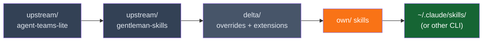

# Skills

`javi-ai` ships 57 skills organized in a 3-layer model (per ADR-003): **upstream** (two repos, unmodified), **delta** (overrides and extensions), and **own** (custom creations).

## Upstream Skills

27 skills from two upstream repos (kept unmodified):

- **`upstream/agent-teams-lite/skills/`** — 12 skills from [agent-teams-lite](https://github.com/Gentleman-Programming/agent-teams-lite)
- **`upstream/gentleman-skills/curated/`** — 15 skills from [Gentleman-Skills](https://github.com/Gentleman-Programming/gentleman-skills)

These cover a wide range of development domains:

### Skill Categories

| Domain | Skills |
|--------|--------|
| **Backend** | go-backend, chi-router, pgx-postgres, fastapi, django-drf, spring-boot-3/4, graphql, gRPC, websockets, error-handling, jwt-auth, BFF, search, notifications |
| **Frontend** | frontend-web, frontend-design, astro-ssr, mantine-ui, tanstack-query, zustand-state, zod-validation |
| **Infrastructure** | docker-containers, kubernetes, traefik-proxy, woodpecker-ci, chaos-engineering, opentelemetry |
| **Database** | redis-cache, sqlite-embedded, timescaledb, graph-databases, pgx-postgres |
| **Data / AI** | langchain, vector-db, scikit-learn, pytorch, mlflow, onnx-inference, duckdb-analytics, powerbi |
| **Mobile** | ionic-capacitor, react-native |
| **Systems / IoT** | rust-systems, tokio-async, modbus-protocol, mqtt-rumqttc |
| **Workflow** | git-workflow, wave-workflow, obsidian-brain-workflow, ide-plugins |
| **Docs** | technical-docs, api-documentation, mustache-templates |

### Delta Layer

The `delta/` directory customizes upstream skills without modifying the originals:

- **`delta/overrides/`** — 10 modified `SKILL.md` files that replace ATL upstream versions entirely
- **`delta/extensions/`** — 2 `EXTENSION.md` appends (sdd-apply, sdd-explore)

See [Extension Model](extension-model.md) for details.

## Own Skills

29 custom skills created from scratch:

| Skill | Description |
|-------|-------------|
| **skill-creator** | Meta-skill for creating new AI agent skills |
| **obsidian-brain** | Integration with Obsidian for project memory |
| **obsidian-kanban** | Kanban board management in Obsidian |
| **obsidian-dataview** | Dataview queries for Obsidian |

## Shared Conventions

The `_shared/` directory contains cross-cutting conventions that apply to all skills, such as naming patterns, file structure standards, and common workflows.

## Installation Priority

Skills are installed in this order (later overwrites earlier if same name):

1. **upstream/agent-teams-lite/** — 12 ATL skills (lowest priority)
2. **upstream/gentleman-skills/** — 15 GS skills
3. **delta/overrides/** — 10 modified SKILL.md replacements for ATL skills
4. **delta/extensions/** — 2 EXTENSION.md appends
5. **own/** — 29 custom skills (highest priority, override upstream if names collide)
