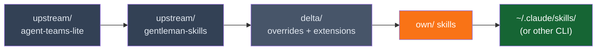

# Skills

`javi-ai` ships 70 skills organized in a 3-layer model (per ADR-003): **upstream** (two repos, unmodified), **delta** (overrides and extensions), and **own** (custom creations).

## Upstream Skills

27 skills from two upstream repos (kept unmodified):

- **`upstream/agent-teams-lite/skills/`** — 12 skills from [agent-teams-lite](https://github.com/Gentleman-Programming/agent-teams-lite)
- **`upstream/gentleman-skills/curated/`** — 15 skills from [Gentleman-Skills](https://github.com/Gentleman-Programming/gentleman-skills)

These cover a wide range of development domains:

### Skill Categories

| Domain | Skills |
|--------|--------|
| **Backend** | go-backend, chi-router, pgx-postgres, fastapi, django-drf, spring-boot-3/4, graphql, gRPC, websockets, error-handling, jwt-auth, BFF, search, notifications |
| **Frontend** | frontend-web, frontend-design, astro-ssr, mantine-ui, tanstack-query, zustand-state, zod-validation |
| **Infrastructure** | docker-containers, kubernetes, traefik-proxy, woodpecker-ci, chaos-engineering, opentelemetry |
| **Database** | redis-cache, sqlite-embedded, timescaledb, graph-databases, pgx-postgres |
| **Data / AI** | langchain, vector-db, scikit-learn, pytorch, mlflow, onnx-inference, duckdb-analytics, powerbi |
| **Mobile** | ionic-capacitor, react-native |
| **Systems / IoT** | rust-systems, tokio-async, modbus-protocol, mqtt-rumqttc |
| **Workflow** | git-workflow, wave-workflow, obsidian-brain-workflow, ide-plugins |
| **Docs** | technical-docs, api-documentation, mustache-templates |

### Delta Layer

The `delta/` directory customizes upstream skills without modifying the originals:

- **`delta/overrides/`** — 10 modified `SKILL.md` files that replace ATL upstream versions entirely
- **`delta/extensions/`** — 2 `EXTENSION.md` appends (sdd-apply, sdd-explore)

See [Extension Model](extension-model.md) for details.

## Own Skills

42 custom skills created from scratch:

| Skill | Description |
|-------|-------------|
| **adversarial-review** | Multi-perspective adversarial code review — security, quality, and test perspectives review in parallel, then synthesize |
| **agent-governance** | Declarative agent capability model with privilege rings, kill switches, and behavioral anomaly detection |
| **agent-testing** | Testing pyramid for AI agents — unit tests for prompts, scenario tests for workflows, and evaluation suites for quality |
| **auto-continuation** | Recursive agent spawning with context preservation for tasks that exceed a single context window |
| **blast-radius** | Dependency graph analysis that identifies only affected files for any change, reducing token usage by up to 49x |
| **circuit-breaker** | Runtime safety protocol for detecting and killing runaway SDD sub-agents — monitors tokens, tool calls, duration, and failures |
| **codebase-cartography** | Auto-generate codebase maps for AI context — file trees, dependency graphs, and architectural overviews |
| **competitive-planning** | Dual-dispatch competitive planning — two sub-agents generate competing plans, then a judge picks the best |
| **complexity-router** | Classifies task complexity (Small/Medium/Large) and routes to specialized agents with fresh context per phase |
| **compound-loop** | Post-task learning capture workflow — documents what was learned, appends to learnings.md, and suggests CLAUDE.md improvements |
| **conversation-capture** | Capture, index, and search AI conversation sessions from Claude Code, Codex, and Gemini logs using engram |
| **cost-tracking** | AI token usage and cost tracking patterns — per-session monitoring, budget alerts, model cost comparison, and optimization |
| **debug-mode** | Hypothesis-driven debugging with tagged instrumentation, isolated logs, and automated cleanup |
| **discovery-relay** | Cross-wave discovery relay for SDD parallel apply — sub-agents save runtime discoveries to engram for next-wave injection |
| **embedding-strategies** | Embedding model selection, optimization, and evaluation for search and RAG systems |
| **llm-evaluation** | Comprehensive LLM evaluation framework with automated metrics, LLM-as-Judge, and RAG evaluation |
| **multi-round-synthesis** | Multi-round agent orchestration — coordinator delegates to specialists, synthesizes, and iterates until complete |
| **nano-mode** | SDD-lite for small changes — fast-track challenge/plan/build/review, all inline, no sub-agents |
| **obsidian-braindump** | Quick capture of thoughts and decisions into Obsidian vault |
| **obsidian-consolidation** | Periodic synthesis of scattered notes into frameworks and insights |
| **obsidian-resource-capture** | Capture URLs and resources with auto-extracted insights into Obsidian vault |
| **plan-pact** | Cross-agent negotiation protocol for planning documents with Decision Register and dispute tracking |
| **playbooks** | Executable markdown playbooks for AI agents — checkbox task documents, batch processing, and repeatable workflows |
| **poml-templates** | POML (Prompt Orchestration Markup Language) conventions for structured, composable, testable prompts |
| **project-memory** | Auto-generates CLAUDE.md capturing project knowledge, flags one-way-door decisions, generates LESSONS.md retrospectives |
| **prompt-engineering** | Advanced prompt engineering patterns for production LLM applications |
| **pr-review** | Review GitHub PRs and Issues with structured analysis for open source projects |
| **rag-advanced** | Advanced RAG patterns beyond basic retrieval — HyDE, reranking, hybrid search, and production strategies |
| **ralph-loop** | Fresh context per iteration for long SDD sessions — state persists in engram, agent context resets between iterations |
| **reverse-engineer** | Auto-generates PRD and Design Docs from existing code, then verifies them against the codebase |
| **sdd-enhanced** | Enhanced SDD pipeline with codebase indexing, AGENTS.md export, and precision-guided navigation |
| **self-evolving-skills** | Learning protocol that makes skills improve with usage — log outcomes to engram, load past learnings before invocation |
| **semantic-locking** | Multi-agent semantic locking for SDD parallel apply — symbol-level locking via engram replaces file-level isolation |
| **session-audit-trail** | Audit trail protocol for SDD workflow executions — run tracking, append-only event logs, replay, and engram integration |
| **session-memory** | Session memory patterns and toolset profiles — persistent context, /remember commands, and mode-based tool access |
| **skill-creator** | Creates new AI agent skills following the Agent Skills spec |
| **skillguard** | Security scanner for AI agent skills — detects credential theft, code injection, data exfiltration, and scope escape |
| **subagent-observability** | Parse Claude Code JSONL session files to extract per-sub-agent metrics: tokens, tool calls, bottlenecks, and cost |
| **tiered-routing** | 4-tier cost-optimized routing protocol — pattern match, session state, keyword lookup, and LLM classification |
| **token-compression** | 5-layer token compression engine that reduces AI context costs by 70-97% |
| **vector-index-tuning** | Vector index optimization — HNSW tuning, quantization, and performance monitoring for production search |
| **worktree-flow** | Automated git worktree workflows — isolate each task in its own worktree, work in parallel, and auto-create PRs |

## Shared Conventions

The `_shared/` directory contains cross-cutting conventions that apply to all skills, such as naming patterns, file structure standards, and common workflows.

## Installation Priority

Skills are installed in this order (later overwrites earlier if same name):

1. **upstream/agent-teams-lite/** — 12 ATL skills (lowest priority)
2. **upstream/gentleman-skills/** — 15 GS skills
3. **delta/overrides/** — 10 modified SKILL.md replacements for ATL skills
4. **delta/extensions/** — 2 EXTENSION.md appends
5. **own/** — 42 custom skills (highest priority, override upstream if names collide)
