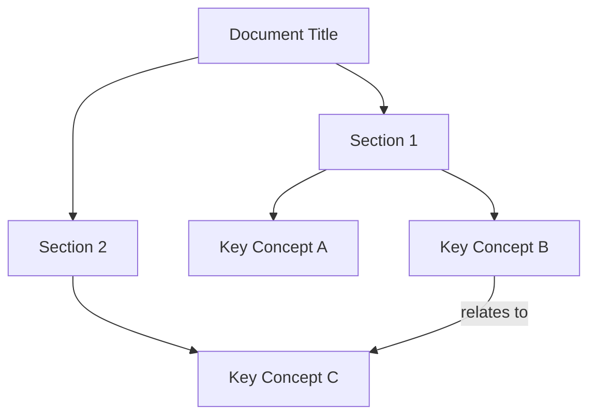
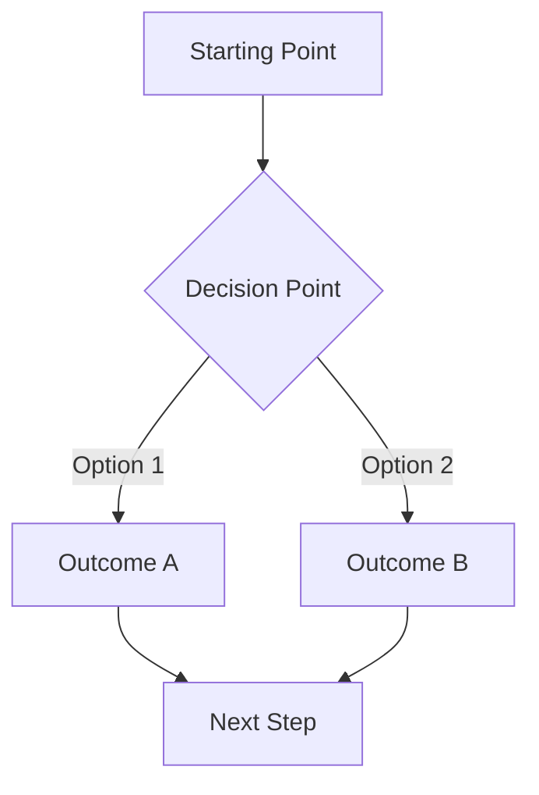
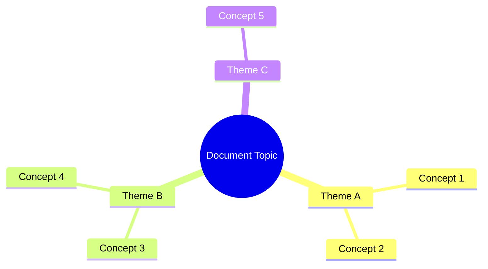
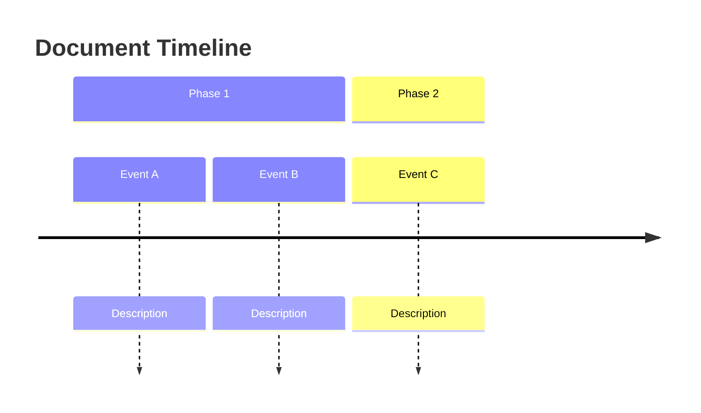
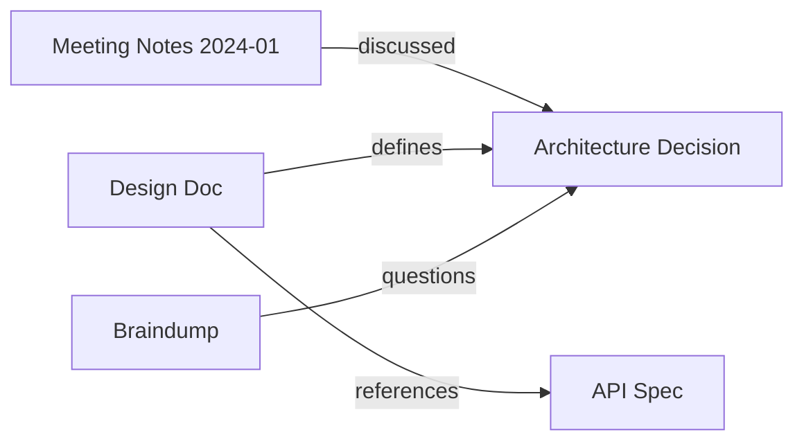

## Purpose

Markdown documents (notes, wikis, specs, meeting notes) contain implicit structure and relationships that are hard to see in prose form. This skill extracts that structure and renders it as Mermaid diagrams — making invisible connections visible.

This is NOT for code visualization (use repoforge/mermaid for that). This is for DOCUMENTS: notes, specs, braindumps, knowledge base articles, meeting notes, decision records.

---

## 1. Core Principle

```
Document (prose)  →  Structure extraction  →  Mermaid diagram
                     ├─ Heading hierarchy   →  Flowchart / Mindmap
                     ├─ Concept relations   →  Flowchart with edges
                     ├─ Temporal sequences   →  Timeline
                     └─ Entity connections   →  Flowchart (graph)
```

---

## 2. Supported Diagram Types

| Type | Best For | Mermaid Syntax |
|------|----------|---------------|
| **Flowchart** | Document structure, process descriptions, decision flows | `flowchart TD` |
| **Mindmap** | Concept hierarchies, braindump organization, topic clusters | `mindmap` |
| **Timeline** | Chronological events, project history, meeting decisions over time | `timeline` |

The agent selects the diagram type based on document content, or the user can request a specific type.

### Auto-Selection Heuristic

| Document Signal | Selected Type |
|----------------|---------------|
| Has sequential steps, "then", "after", numbered lists | Flowchart |
| Has dates, "week of", temporal markers | Timeline |
| Is a braindump, has many unrelated topics, wiki-style | Mindmap |
| Has decision points, "if/else", alternatives | Flowchart with diamonds |
| Has entity relationships, "depends on", "connects to" | Flowchart (graph LR) |
| Ambiguous or mixed | Mindmap (safest default) |

---

## 3. Extraction Process

### Step 1 — Read the Document

Read the full markdown document. Identify:
- **Headings** (h1-h6): These form the skeleton
- **Bold/italic terms**: Often key concepts
- **Wiki-links** (`[[term]]`): Explicit entity references
- **Lists**: Enumerations of related items
- **Temporal markers**: Dates, "before/after", sequences

### Step 2 — Build Concept Graph

Extract a list of **nodes** (concepts/entities) and **edges** (relationships):

```
Nodes: Each heading, bold term, or wiki-linked entity
Edges: Implied by:
  - Heading hierarchy (parent → child)
  - "X depends on Y", "X leads to Y" (explicit)
  - Co-occurrence in same paragraph (weak link)
  - Sequential order in lists (flow)
```

**Cap**: Maximum 30 nodes per diagram. If more, group into clusters or generate multiple diagrams.

### Step 3 — Generate Mermaid

Apply the selected diagram type to the extracted graph.

---

## 4. Output Templates

### Flowchart (Document Structure)



### Flowchart (Process/Decision)



### Mindmap (Concept Hierarchy)



### Timeline (Chronological)



---

## 5. Relationship Extraction Patterns

The agent looks for these linguistic patterns to build edges:

| Pattern in Prose | Edge Type | Mermaid |
|-----------------|-----------|---------|
| "X depends on Y" | dependency | `Y --> X` |
| "X leads to Y", "X causes Y" | causal | `X --> Y` |
| "X is part of Y" | composition | `Y --> X` |
| "X vs Y", "X or Y" | alternative | `X -.- Y` (dotted) |
| "X relates to Y", "X and Y" | association | `X --- Y` |
| "after X, then Y" | sequence | `X --> Y` |
| "if X then Y else Z" | decision | `X{decision} -->|yes| Y` / `-->|no| Z` |

---

## 6. Multi-Document Mode

When given multiple documents (e.g., a folder of notes):

1. Generate individual diagrams per document
2. Generate ONE cross-document relationship diagram showing how documents connect
3. Use document titles as top-level nodes, shared concepts as edges



---

## 7. Integration with Obsidian

When the source document contains `[[wiki-links]]`:

- Each wiki-linked entity becomes a node automatically
- Links between documents become edges
- Tags (`#tag`) can be used to color-code or group nodes

### Obsidian-Specific Output

Wrap the diagram in a mermaid code block that Obsidian renders natively:

````markdown

````

---

## 8. Quality Rules

1. **Max 30 nodes** per diagram — split into multiple if needed
2. **Meaningful labels** — use actual concept names, not generic "Node 1"
3. **Edge labels** — add relationship type when non-obvious
4. **No orphan nodes** — every node must connect to at least one other
5. **Readable direction** — TD for hierarchies, LR for processes/timelines
6. **Quote node labels** — always wrap in `["quotes"]` to handle special characters
7. **Escape Mermaid syntax** — avoid `(`, `)`, `[`, `]` inside node labels without quotes

---

## 9. Workflow

```
1. User provides markdown document(s) or file path(s)
2. Read document content
3. Detect best diagram type (or use user-specified)
4. Extract nodes and edges
5. Generate Mermaid code
6. Output inline OR write to file (user's choice)
7. If Obsidian vault: suggest placement in same folder as source
```

---

## Critical Rules

1. This skill is for DOCUMENTS, not code. Do not analyze source code files.
2. Always cap at 30 nodes per diagram. Suggest splitting if more concepts exist.
3. Select diagram type automatically unless user specifies one.
4. Preserve the document's actual terminology — do not rephrase concept names.
5. Wiki-links (`[[entity]]`) are first-class nodes — always include them.
6. Output valid Mermaid syntax that renders in GitHub, Obsidian, and mermaid.live.
7. For multi-document mode, always generate both per-doc and cross-doc diagrams.
8. When relationships are ambiguous, prefer weaker edge styles (dotted) over strong arrows.
